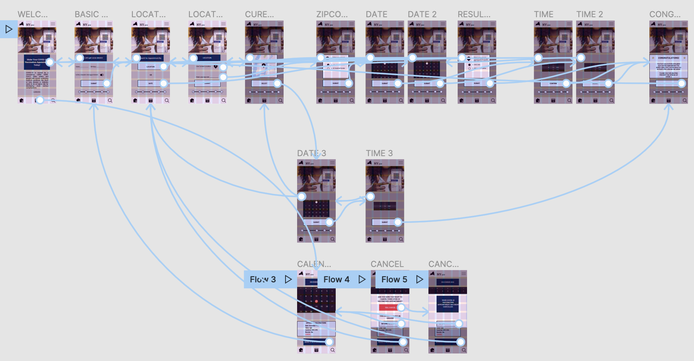

# A08: High Fidelity Interactive Prototype
*by Lana Garrett// DH110// Fall 2021*
## Overview
### Purpose
> The purpose of creating a high-fidelity prototype for this assignment is to visualize the functional and UX/UI design of my NY COVID appointment app. By making this prototype on Figma, I can easily make changes to the UI/UX design while walking through the interactive prototype.
### Process
> This high-fidelity, interactive prototype was created based on several steps throughout the design process. First, the interactions included in this prototype were chosen based on observations made during usability testing and contextual analysis. Next, I created 2 user personas that fit my ideal app user. Then, I hand-drew wireframes and wireflows as part of a low-fidelity prototype. I then tested this with a user as well. Feedback from both users helped me to design a more ready-to-use app. I incorporated these changes and feedback into my interactive, high-fidelity prototype. This prototype reflects my user's feedback as well personal creative changes made throughout the design process.
## Tasks
### Task 1:
> The first task on our New York COVID-19 vaccinaiton appointment app is to create an appointment. This is the primary function of the app. By making your appoointment via the mobile app, the population will have more free time at their disposal.
### Task 2:
> The second task on the New York COVID-19 vaccinaiton appointment app is to use the calendar funcition, specifically how to cancel an appointment that has been made. In this section of the app, the user can also look at their appointment they've made and the detials of their appointments. In this task we are simply testing the cancel function.
#### Prototype
> My high-fidelity, interactive prototype can beb found [here](https://www.figma.com/proto/zQde8zfSSDwme3zbCvIUJ6/Untitled?node-id=23%3A294&scaling=scale-down&page-id=0%3A1&starting-point-node-id=1%3A6).
## Wireframes
> My two tasks are quite intertwined so I created one wireframe for the two tasks. This is because the two tasks are so closely related that they often lead to one another (Ex: looking at your past vaccination in calendar might prompt you to create a new appointment for a second dose). Below is this wireframe.

## Cognitive Walkthrough
> The link to my cognitive walkthrough can be found [here](https://youtu.be/t3cjgRH6pUg).
### Reflection of Findinds from Cognitive Walkthrough:
> While walking my user through the app she could complete both tasks, making an appointment (both by location and date) and cancelling an appointment, with ease. My user did, however, think that the "Let's get some detials" title box was a button. The undo button was also not that noticeable to my user. This may be because she did not hit need to use the undo function or because it was not eye-catching enough.
### Changes Made After Cognitive Walkthrough
> After the cognitive walkthrough, I made sure that all page titles were in boxes filled with 00284D, the dark blue, and white text. I also made sure that all buttons were filled with D0EBFF, the light blue, and black text. During the cognitive walkthough with my user Simone, I believe that this distinction was not made. I will be able to determine if this destinction between buttons and page titles is clear when I conduct my next cognitive walkthrough.
### Summary and Changes
> After the low-fidelity prototype I had made numerous changes. I reformatted the size to fit the most recent iPhone, the iPhone 13 Max. I also redid the layout bars so the layout of my app could be cleaner. In addition to these changes, I also made all my buttons rectangles instead of ovals as they give off a more formal feel. After freating this high-fidelity prototype, there is still more work to be done. I also added the additon of FC4040, a red color, to my app. This aids in drawing attention to the cancel button when a user needs to cancel their appointment. Conducting another cognitive test to test the undo button will prove to be very useful as well as a cognitive test to see if a user can differentiate between the page title and button on the "Basic Info" page of the app.
